# School Analytics Demo

## Overview

Demonstration created to show a Database schema ingestion into AWS and a Serveless Data Lake approach focused on education data.

### Architecture

<p align="center"> 
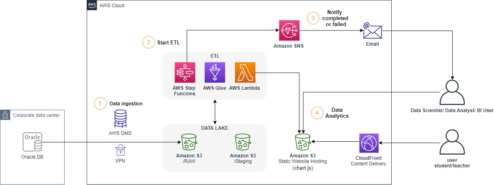
</p>

_Note: To simulate the On-premisses Oracle DB we are going to spin-up a EC2 Instance with Oracle installed and create our own schema. So our demo final architecture will look like:_

<p align="center"> 
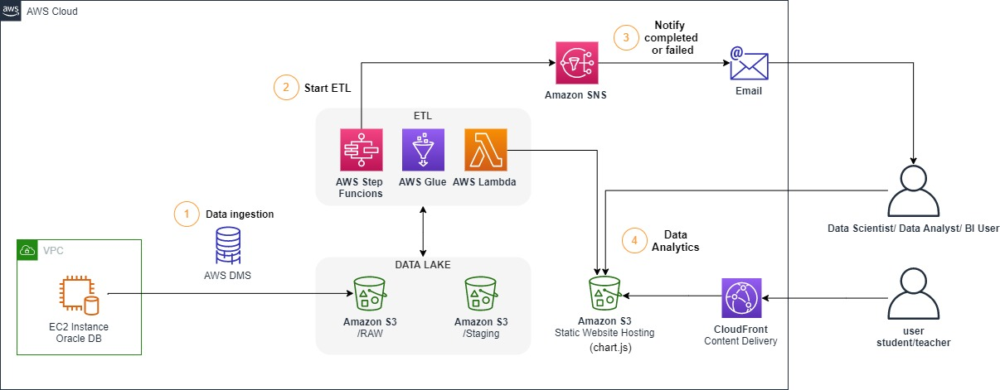
</p>

## Getting Started

Pre-requisites:

* [Clone/Download the repository](https://docs.github.com/en/github/creating-cloning-and-archiving-repositories/cloning-a-repository); 
* [AWS Account](https://aws.amazon.com/premiumsupport/knowledge-center/create-and-activate-aws-account/); 
* [AWS CLI](https://docs.aws.amazon.com/cli/latest/userguide/install-cliv2.html); 
* [Setup CLI credentials](https://docs.aws.amazon.com/cli/latest/userguide/cli-configure-quickstart.html#cli-configure-quickstart-config);
* [Create a KeyPair to ssh on EC2 Instance](https://docs.aws.amazon.com/AWSEC2/latest/UserGuide/ec2-key-pairs.html#having-ec2-create-your-key-pair)
* Run the demonstration on the **us-east-1** region 

### [AWS CloudFormation](https://aws.amazon.com/cloudformation/)

In this repository we have one [AWS CloudFormation](https://aws.amazon.com/cloudformation/) Template that we are going to use to provision the stack.
After you´ve cloned the repository on your machine, run: 
``` bash
aws cloudformation create-stack --stack-name aws-school-analytics-stack --template-body file://cloudformation/School-Analytics-Demo-Resources.json --parameters ParameterKey=UserEmail,ParameterValue=<USER_EMAIL> ParameterKey=KeyPairName,ParameterValue=<KEY_PAIR> --capabilities CAPABILITY_NAMED_IAM
```

**Values to be replaced:**

* **<USER_EMAIL>** - The user e-mail to receive new data notifications.
* **<KEY_PAIR>** - The name of the Key Pair you want to use to ssh your EC2 (do not add the extension .pem)

Wait the stack status to be **CREATE_COMPLETE**. 

``` bash
aws cloudformation describe-stacks --stack-name aws-school-analytics-stack --query "Stacks[0].StackStatus" --output text
# if template creation fails you can delete it with the code bellow:
# aws cloudformation delete-stack --stack-name aws-school-analytics-stack
```
Open the AWS console on the cloudformation service and open the aws-school-analytics-stack under the output tab. (You are going to need these outputs for the next steps)

### Connecting and Creating the Database

#### Configuring the Security Group
First Thing we need to do is to configure our EC2 Instance Security Group. 
Get the DMSReplicationInstance Private Ip running: 

``` bash
 aws dms describe-replication-instances --filters Name="replication-instance-id",Values="school-data-replicationinstance" --query "ReplicationInstances[*].ReplicationInstancePrivateIpAddress" --output text
```
save the Private Ip address.

Open the ec2 service on the AWS console click on "Security Groups" in the left menu. Select the oracle-db-sg>Inbound Rules. Open the port 22 to your ip only and port 1521 to the DMS Replication Instance private ip:

<p align="center"> 
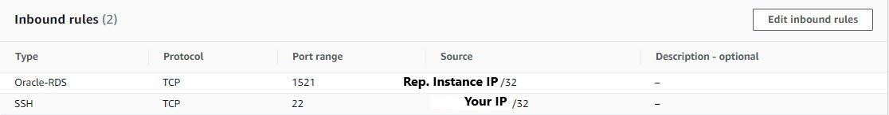
</p>

#### Connect to EC2 instance

get the ec2 instance public ip running:
``` bash
aws ec2 describe-instances --filters "Name=tag:Name,Values=Oracle DB" --query "Reservations[*].Instances[*].PublicIpAddress" --output text
```
go to the directory that contains your key file and SSH your ec2 instance with:

``` bash
ssh -i "<KEY_PAIR>" ec2-user@<EC2_Public_IP>
```
**Values to be replaced:**

* **<KEY_PAIR>** - The name of the Key Pair you want to use to ssh your EC2 (with the extension .pem)

* **<EC2_Public_IP>** - The EC2 instance public IP

#### Configure OracleDB

configure the password for your database as **Analytics123** (this step can take some minutes): 
``` bash
sudo /etc/init.d/oracle-xe-18c configure
```
After configuring the password we can test the access to the database:
``` bash
. oraenv
```
Define XE as the Oracle SID:
<p align="center"> 
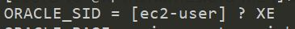
</p>
then run:

``` bash
sqlplus sys/Analytics123@//localhost:1521/XE as sysdba
exit
```

##### Create Listener
We need to create a listener in order to connect directly to our PDB and configure DMS access.
exit your ec2 instance.
get the ec2 instance private IPv4 DNS name running:
``` bash
aws ec2 describe-instances --filters "Name=tag:Name,Values=Oracle DB" --query "Reservations[*].Instances[*].PrivateDnsName" --output text
```
save that value for the next step. SSH your ec2 again and then run:

``` bash
cd /
sudo vi ./opt/oracle/product/18c/dbhomeXE/network/admin/tnsnames.ora 
```

 Add this record to the tnsnames.ora file (substitute <your-ec2-ip-Private-IPv4-DNS> to your ec2 private dns):
``` bash
PBDORCL =
(DESCRIPTION =
(ADDRESS = (PROTOCOL = TCP)(HOST = <your-ec2-Private-IPv4-DNS>)(PORT = 1521))
(CONNECT_DATA =
(SERVER = DEDICATED)
(SERVICE_NAME = XEPDB1)
)
)
```
(**using the vi editor**: press **i** to insert the record to the tnsnames file. press **esc** to leave the insert mode and **:wq + enter** to save the file and quit).
At the end your tnsnames.ora files should look like this:
<p align="center"> 
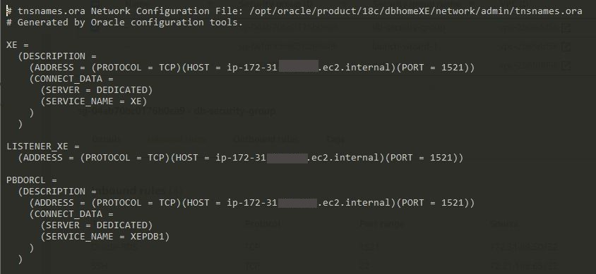
</p>
save it and close it.

##### Create Tables
Connect to your database using SYS user (if you´ve logged out run the .oraenv command before):
``` bash
sqlplus sys/Analytics123@//localhost:1521/XEPDB1 as sysdba
```
run the [usersconfig.sql](/sql/usersconfig.sql) script, and then exit. 

Now, lets configure the schema using PDBADMIN user:
``` bash
sqlplus PDBADMIN/Analytics123@//localhost:1521/XEPDB1
```
Once you´re in run the [CreateTables SQL Script](/sql/create-school-database.sql) and then the [GRANTSDMSUSER SQL Script](/sql/grantsdmsuser.sql). (don´t forget to commit the changes and then exit the sqlplus).

Now we have our schema and our DMS user permissions set.
 To confirm if everything is working run(if you´ve logged out run the .oraenv command before):
``` bash
sqlplus DMS_USER/Analytics123@//localhost:1521/XEPDB1
SELECT * FROM PDBADMIN.ALUNOS;
SELECT * FROM PDBADMIN.PROFESSORES;
SELECT * FROM PDBADMIN.DISCIPLINAS;
SELECT * FROM PDBADMIN.NOTAS WHERE ID_NOTA<10;
```
if the tables return data, all of the database configurations are working fine. exit the sqlplus and run this commands to make the dms endpoint connection possible and then exit the ec2 instance:

``` bash
sudo systemctl stop firewalld
sudo systemctl stop iptables
exit
```

### Data Ingestion
We are all set now. Test the endpoint conection running:
``` bash
aws dms test-connection --replication-instance-arn <REPLICATION_TASK_ARN> --endpoint-arn <SOURCE_ENDPOINT_ARN> 
#wait for the output of the next query to be 'sucessfull'
aws dms describe-connections --query "Connections[?EndpointIdentifier=='oracle-db-ec2-instance'].Status" --output text
```
Start the DMS migration task running:
``` bash
aws dms start-replication-task --replication-task-arn <REPLICATION-TASK-ARN> --start-replication-task-type start-replication
```
**Values to be replaced:**

* **<REPLICATION_TASK_ARN>** - The ARN of the replication task (search for 'ReplicationTask' on the resources tab on the cloudformation stack) 
* **<REPLICATION_INSTANCE_ARN>** - The ARN of the replication instance (search for 'DMSReplicationInstance' on the resources tab on the cloudformation stack) 
* **<SOURCE_ENDPOINT_ARN>** - The ARN of the source endpoint (search for 'SourceEndpoint' on the resources tab on the cloudformation stack)


wait for the FullLoadProgressPercent to be equal 100 (when you get 100, it means the stack status is Load Complete):

``` bash
aws dms describe-replication-tasks --filters Name="replication-task-arn",Values="<REPLICATION_TASK_ARN>" --query "ReplicationTasks[*].ReplicationTaskStats"
```

now we have all of our Raw Data in S3. Verify Migration by listing our DataBucket files(you must have directories ALUNOS,PROFESSORES,DISCIPLINAS and NOTAS):

``` bash
aws s3 ls <S3_DATABUCKET_PATH>/DMS_RAW/PDBADMIN/
```

**Values to be replaced:**

* **<S3_DATABUCKET_PATH>** - The data bucket path (search for it on the outputs tab on the cloudformation stack) 

### Starting ETL Workflow

Now we are going to start or ETL workflow. ETL workflow is running on [AWS Step Functions](https://aws.amazon.com/step-functions/). With [AWS Step Functions](https://aws.amazon.com/step-functions/) we are starting our job in [AWS Glue](https://aws.amazon.com/glue/), verifying if our job has succeded and sending a notification (to be received by e-mail) to confirm job success.

#### Accept SNS Topic Subscription
When we created our resources with Cloudformation we have created a SNS topic where we are going to send messages when we have new data under the staging folder on our S3bucket. Go to your e-mail and confirm your subscription:
<p align="center"> 
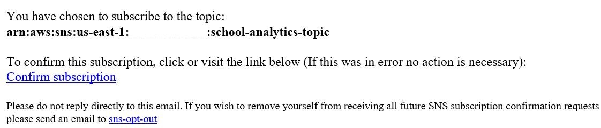
</p>
<p align="center"> 
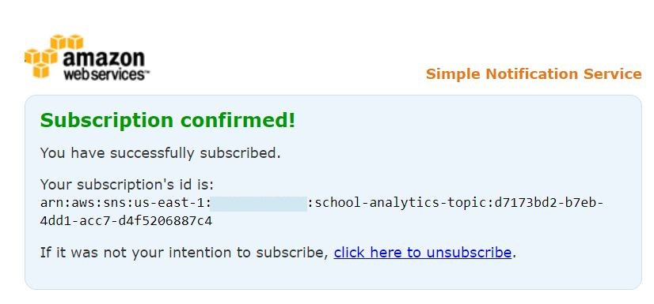
</p>

#### Edit job.py file
Edit the [job.py](etl-job/gluejob.py) file adding your s3 data bucket path where we have **YOURBUCKETPATH** field. You can find this path on the output tab on the cloudformation console.
after editing it add the file to our data bucket:

``` bash
cd etl-job
aws s3 cp gluejob.py <YOURBUCKETPATH>/GLUE_SCRIPT/gluejob.py
```
#### Start our State Machine Execution

<p align="center">
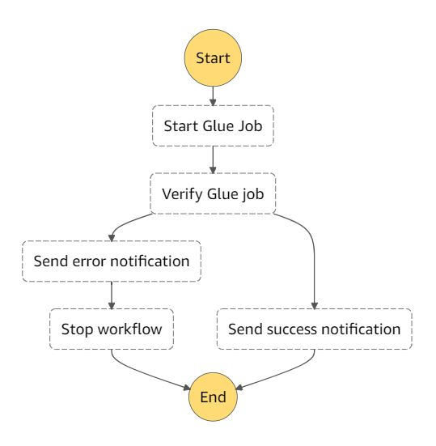
</p>

To start the workflow we could schedule, work based on events, but in this case for demonstration we are running on-demand. Execute the command bellow to start the workflow, at the end you are going to receive a notification on the subscribed e-mail.

``` bash
aws stepfunctions start-execution --state-machine-arn <STATE_MACHINE_ARN> 
```
**Values to be replaced:**

* **<STATE_MACHINE_ARN>** - The ARN from the state machine(get from the resources tab on the cloudformation stack, search for 'ETLWorkflowStateMachine')

Wait for the email notification. if the message inside the e-mail says "New data at staging environment!", we can now use our data to analytics workloads.

### Consuming Data

After we received the notifications, a lambda function edit the json output from glue to be in an array format and the final data.json document is already in the web bucket to be used in our webapp. 

#### Adding the files to our S3 Web Bucket
With cloudformation, we´ve already configured s3 to host a static website and distribute that content using cloudfront. But we still need to add our application files (html,css and js) to our bucket so we can see the final dashboards in our webapp. To do that run:
``` bash
aws s3 cp webapp <WEB_BUCKET_PATH> --recursive 
```
**Values to be replaced:**

* **<WEB_BUCKET_PATH>** - The web bucket path(get from the output tab under cloudformation)

#### Access the web app 

Go to the output tab on the cloudformation console and click on the Cloudfront Distribution output. You will be able to see a analytics web application build with chart.js to give insights inside student and teacher data. To access the console put an id from 1 to 20 or p1 to p7 for teachers dashboards. Here are some examples of dashboards:

<p align="center"> 
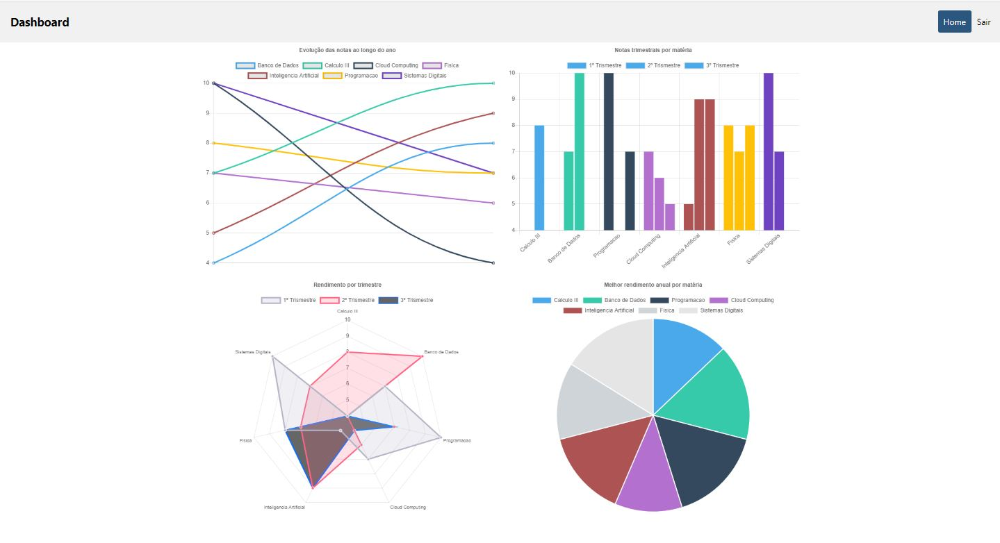
</p>
<p align="center"> 
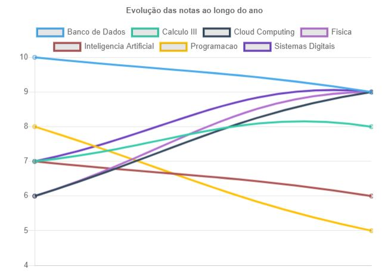
</p>
<p align="center"> 
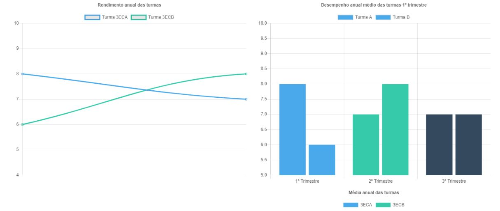
</p>

## Cleaning Up

1) Deleting [Amazon S3](https://aws.amazon.com/s3/) data:

``` bash
aws s3 rm <WEB_DATABUCKET_PATH> --recursive
```
2) Deleting IAM inline policy:

``` bash
aws iam delete-role-policy --role-name role-etl-workflow --policy-name snspublish-stepfunction
```

3) Deleting [AWS CloudFormation](https://aws.amazon.com/cloudformation/) stack:

``` bash
aws cloudformation delete-stack --stack-name aws-school-analytics-stack
```

## References
* https://docs.aws.amazon.com/dms/latest/userguide/CHAP_Source.Oracle.html
* https://aws.amazon.com/blogs/big-data/build-and-automate-a-serverless-data-lake-using-an-aws-glue-trigger-for-the-data-catalog-and-etl-jobs/
* https://aws-dataengineering-day.workshop.aws/
* https://www.chartjs.org/docs/latest/samples/bar/vertical.html

## Security

See [CONTRIBUTING](CONTRIBUTING.md#security-issue-notifications) for more information.

## License

This library is licensed under the MIT-0 License. See the [LICENSE](LICENSE) file.